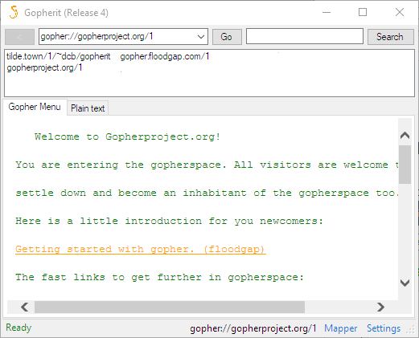

# gopherit 
VB.NET Gopher browser using curl as a backend 

## Prerequisites
- Windows XP+ (probably, only tested with 10)
- .NET Framework 4
- <a href="https://curl.haxx.se/download.html#Win32">A Generic Windows curl binary</a> (in the same folder, named "curl.exe")
- Visual Studio 2018 (Community) if you're building from source
## Features
- Browse gopherspace (woah)
- Bookmarks
- File downloads
- Create gophermaps with the Mapper
- Edit the stylesheet used to display gopher menus as HTML
- Set as URL handler (requires administrative privileges)
- *Accelerated with Internet Explorer(tm) technology*
## Canary builds
Canary builds are done automatically with each commit. You can download Canary builds at the [AppVeyor artifacts page](https://ci.appveyor.com/project/dotcomboom/gopherit/build/artifacts). These are cutting-edge builds that have the latest features, bugs, and bug fixes in the codebase.
